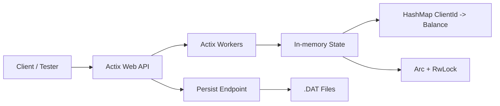
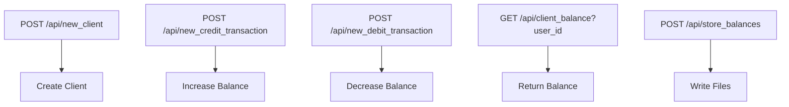

# PrexCORE Payment Processor Challenge

Mini payment processor implemented in **Rust** using **Actix Web**.

The service keeps client balances in memory and persists them to `.DAT` files when requested through the `/store_balances` endpoint.

---

## Tech Stack

- Rust 1.95.0
- Actix Web
- Tokio runtime
- Serde
- rust_decimal
- Docker / Docker Compose

---

## Design Decisions

### In-memory state

The challenge explicitly requires balances to be kept in memory.  
For that reason, the core storage is based on a `HashMap<ClientId, Balance>`.

To ensure **thread safety under concurrent requests**, the HashMap is wrapped in synchronization primitives:

- `Arc` → shared ownership across threads
- `RwLock` → safe concurrent access

This allows multiple HTTP workers to operate on shared state without data races.

#### Complexity

- Create client → **O(1)** average
- Lookup client → **O(1)** average
- Credit/debit → **O(1)** average
- Store balances → **O(n)**

This choice prioritizes **low-latency, high-frequency operations**, which is critical in payment systems.

---

### Concurrency Model (Workers)

The application leverages:

- **Actix Web workers** → handle incoming HTTP requests concurrently
- **Tokio runtime** → async execution and task scheduling

Each request is processed independently, while shared state is accessed through synchronized structures.

> Async is used here primarily for concurrency, not latency hiding.

---

### Concurrency Trade-offs

Using `RwLock` allows multiple readers or a single writer.

However, under high write contention:

- Write locks may become a bottleneck
- Throughput may degrade

Production alternatives may include:

- Sharded state (partitioned HashMaps)
- Lock-free structures (e.g. DashMap)
- Actor-based models (per-account isolation)

---

### Event-driven Intention

Although the current implementation is synchronous at the HTTP layer, the design follows an **event-driven mindset**:

Each operation (credit, debit) can be interpreted as an event:

- `BalanceCredited`
- `BalanceDebited`

This abstraction prepares the system for evolution toward distributed architectures.

---

### Future Evolution (Production-grade)

In a real payment processor, this architecture would evolve into an **event-driven system** built on:

- **Message brokers (Kafka / RabbitMQ)** for reliable event delivery
- **Database persistence (PostgreSQL)** for durable storage
- **Transaction logs or event sourcing** for auditability
- **Distributed services (microservices)** for scalability

Instead of mutating in-memory state directly, the system would follow a:

> **command → event → persisted state transition**

#### Event-driven flow

1. API receives request  
2. Validates and registers operation using an **idempotency key**  
3. Creates transaction record (`PENDING`)  
4. Persists transaction in database  
5. Emits event to broker  
6. Consumer processes event  
7. Transaction → `PROCESSING`  
8. Balance mutation is applied  
9. Result is persisted  
10. Transaction → `COMPLETED` or `FAILED`

#### Key principles

- **Idempotency** → safe retries without duplication  
- **Durable persistence** → no data loss  
- **Auditability** → full transaction history  
- **At-least-once delivery** → safe duplicate handling  
- **State transitions** → avoid inconsistent states  
- **Decoupling** → API does not perform critical mutations  

#### Benefits

- Fault tolerance  
- Safe retries  
- Horizontal scalability  
- Backpressure handling  
- Replay and recovery capabilities  

---

### Balance vs Ledger Model (Production Consideration)

The current implementation stores only the final balance per client.

Limitations:

- No transaction history  
- Difficult auditing  
- No rollback capability  

Production systems typically use a **ledger-based model**:

- Each transaction is stored as an immutable record  
- Balances are derived from transaction history  

Benefits:

- Full auditability  
- Easier reconciliation  
- Stronger financial consistency  

---

### Error Handling (Current vs Production)

Current implementation:

- Basic validation (e.g. insufficient funds)
- HTTP status codes for responses

Production considerations:

- Structured error responses (code + message)
- Retry-safe error handling (idempotent responses)
- Clear separation:
  - Client errors (4xx)
  - Server errors (5xx)
- Logging and tracing

---

### Decimal balances

Balances are represented using `Decimal` instead of floating-point numbers.

Floating-point types (`f32`, `f64`) introduce rounding errors:

```text
0.1 + 0.2 ≠ 0.3
```

In financial systems, this is unacceptable.

Using `rust_decimal` ensures:

- Exact arithmetic
- Deterministic results
- No precision loss

---

## API Endpoints

| Method | Endpoint | Description |
|--------|----------|-------------|
| `POST` | `api/new_client` | Creates a new client |
| `POST` | `api/new_credit_transaction` | Credits money |
| `POST` | `api/new_debit_transaction` | Debits money |
| `GET` | `api/client_balance/{user_id}` | Retrieves balance |
| `POST` | `api/store_balances` | Persists balances |

---

## Architecture Overview



---

## Endpoint Flow



---

## How to Run

### Run locally

```bash
cargo run
```

Server: `http://localhost:8080`

---

### Run with Docker

```bash
docker-compose up --build -d
```

Stop:

```bash
docker-compose down
```

---

## Automated Testing

Run all tests:

```bash
cargo test
```

With output:

```bash
cargo test -- --nocapture
```

### Test types

- Unit tests → business logic
- Integration tests → API endpoints

---

## Notes

- Data is stored **in memory**
- Persistence is **manual**
- System prioritizes **low latency over durability**
- Designed with **future scalability in mind**

---